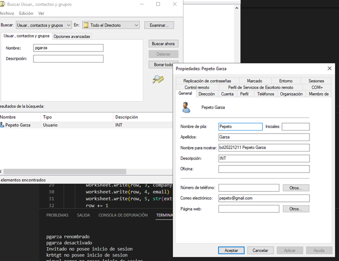

<a name="readme-top"></a>
<!--

<!-- PROJECT SHIELDS -->
<!--
*** I'm using markdown "reference style" links for readability.
*** Reference links are enclosed in brackets [ ] instead of parentheses ( ).
*** See the bottom of this document for the declaration of the reference variables
*** for contributors-url, forks-url, etc. This is an optional, concise syntax you may use.
*** https://www.markdownguide.org/basic-syntax/#reference-style-links
-->
[![Contributors][contributors-shield]][contributors-url]
[![Forks][forks-shield]][forks-url]
[![Stargazers][stars-shield]][stars-url]
[![Issues][issues-shield]][issues-url]
[![MIT License][license-shield]][license-url]


<!-- PROJECT LOGO -->
<br />
<div align="center">
  <a href="https://github.com/othneildrew/Best-README-Template">
    
  </a>

<h3 align="center">Procesador de Cuentas en Desuso Active Directory</h3>

  <p align="center">
    Memoria de título presentada a la Facultad de Ingeniería de la Universidad Finis Terrae, para optar al título de ingeniero civil en informática y telecomunicaciones
    <br />
    <a href="https://mrcoding-dev.github.io/Herramienta-Seguridad-ActiveDirectory-DOC/"><strong>Ver documentacion »</strong></a>
    <br />
    <br />
    <a href="https://github.com/mrcoding-dev/Herramienta-Seguridad-ActiveDirectory/issues">Reportar bug</a>
    ·
    <a href="https://github.com/mrcoding-dev/Herramienta-Seguridad-ActiveDirectory/issues">Solicitar una caracteristica</a>
  </p>
</div>


<!-- ABOUT THE PROJECT -->
## Sobre el proyecto
Este proyecto es un sistema automatizado de gestión de cuentas en desuso de Active Directory.
Incluye un script que monitorea continuamente las cuentas en busca de las que hayan pasado una fecha límite sin ser usadas, y automáticamente desactiva las cuentas encontradas.
Además, cuenta con un sistema de notificaciones para enviar un correo electrónico al final del mes con una lista de las cuentas que se dieron de baja, y una interfaz web que permite visualizar en tiempo real las cuentas que se dieron de baja a través de un identificador único como el RUT o el nombre de usuario.
Este sistema ayuda a mejorar la eficiencia en la gestión de cuentas, proporciona una mejor fluctuación de la información, es más rápido y fácil de implementar al ser un desarrollo focalizado en un proceso y ahorra un recurso entero para ser utilizado en otras labores.

Una vez la herramienta de seguridad de Active Directory está configurada, el sistema automatizado de gestión de cuentas puede ser ejecutado en el entorno. Esto permite que el sistema monitoree el uso de cuentas en tiempo real para detectar posibles amenazas de seguridad. Además, se recomienda ejecutar el script de monitoreo de cuentas cada mes o de acuerdo a lo establecido por las policitas de seguridad de la organizacion, para asegurar que solo las cuentas activas sean consideradas dentro del sistema. El sistema también debe configurarse para enviar notificaciones de correo electrónico al final del mes para informar sobre el estado de cuentas en desuso. Esto le permite a los administradores monitorear el uso de cuentas y asegurar que solo los usuarios autorizados tengan acceso. Finalmente, la interfaz web del sistema proporciona una forma sencilla de visualizar la información sobre las cuentas desactivadas, lo que le permite a los administradores comprobar el uso de cuentas y asegurar que el sistema está seguro.


<!-- GETTING STARTED -->
## Primeros pasos

Para instalar este sistema, necesitas tener Node.js y Python instalados en tu computadora. Continúa siguiendo las instrucciones en el repositorio para configurar y ejecutar la herramienta de seguridad de Active Directory en tu entorno 

### Prerrequisitos

Estos son los requesitos para correr el sistema
* node
  ```sh
  choco install nodejs.install
  ```
  
* python
  ```sh
  npm install npm@latest -g
  ```
* dependencias python

- algoliasearch==2.6.3
- anyio==3.6.2
- asgiref==3.6.0
- certifi==2022.12.7
- charset-normalizer==3.0.1
- Django==4.1.6
- django-scheduler==0.10.1
- fastapi==0.90.0
- future==0.18.3
- icalendar==5.0.4
- idna==3.4
- pyad==0.6.0
- pydantic==1.10.4
- python-dateutil==2.8.2
- python-dotenv==0.21.1
- pytz==2022.7.1
- requests==2.28.2
- six==1.16.0
- sniffio==1.3.0
- sqlparse==0.4.3
- starlette==0.23.0
- typing_extensions==4.4.0
- tzdata==2022.7
- urllib3==1.26.14
- XlsxWriter==3.0.8
### Instalacion

_Below is an example of how you can instruct your audience on installing and setting up your app. This template doesn't rely on any external dependencies or services._

1. Obten tu api de [https://www.algolia.com/es/](https://www.algolia.com/es/)
2. En la vdi o servidor de windows server
   ```sh
   git clone https://github.com/mrcoding-dev/Herramienta-Seguridad-ActiveDirectory/tree/main/backend
   ```
3. Instala los paquetes de pip
   ```sh
   pip install -r requirements.txt
   ```
4. Configura las variables de entorno
   ```makefile
    SENDER_MAIL=yourmail@zohomail.com
    SENDER_PASSWORD=password
    SENDER_SMTP=smtp.zoho.com
    SENDER_PORT=465
    RECIEVER_SMTP=reciever2@gmail.com,reciever1@gmail.com
    COMPANYS_NAME=Empresa1 S.A.,Empresa 2,Empresa 3 S.A.
    LOGO_COMPANY=https://www.webgenerica.cl/assets/img/empresa/logos/logo-5fda3aab9726b.jpg,https://www.webgenerica.cl/assets/img/empresa/logos/logo-5fda3aab9726b.jpg,https://www.webgenerica.cl/assets/img/empresa/logos/logo-5fda3aab9726b.jpg
    app_id=9W91AT????
    api_key =057820d68????????7d89739468
    index_id=dev_?????
    DIAS_DESUSO=90
   ```
   
5. Ejecutar codigo en backend
Existen 3 formas de ejecutar el codigo del backend, primeramente puedes hacerlo simplemente con 

   ```sh
   python app.py
   ```
De esta forma sera ejecutada 1 vez, es de manera manual, la otra forma es con un cron, el cual en el archivo

   ```sh
   backend/month.py
   ```

En la linea 13 puedes configurar mediante la libreria schedule cuando y como ejecutar tu codigo programado mas informacion [aqui](https://schedule.readthedocs.io/en/stable/) 

Y la ultima forma es mediante una api, la cual se puede agregar mas rutas y personalizar en

   ```sh
   backend/main.py
   ```
Para ejecutarlo simplemente se debe ejecutar en  la terminal

   ```sh
   uvicorn main:app --reload
   ```
y este servidor se ejecutara en el http://127.0.0.1:8000

6. Frontend

   ```sh
   git clone https://github.com/mrcoding-dev/Herramienta-Seguridad-ActiveDirectory/tree/main/frontend
   ```
   
En la siguiente ruta agrega la api key de algolia en la linea 6

   ```sh
  src\components\Buscador.js
   ```

   ```js
const searchClient = algoliasearch('APP_ID','API_KEY');
   ```

Y en la linea 40 agrega tu index name
   ```js
<InstantSearch searchClient={searchClient} indexName="YOUR_INDEX" >
   ```

<p align="right">(<a href="#readme-top">back to top</a>)</p>

Finalmente solo ejecuta donde va a ser el servidor cliente

   ```sh
  npm run dev
   ```
O si deseas subirlo a produccion
   ```sh
  npm run build
   ```
## Uso

Este repositorio proporciona una herramienta de seguridad de ActiveDirectory que puede ser consumida desde cualquier servidor gracias a su conexión con la API de Algolia. Para usarla, es necesario instalar Python y las dependencias en un servidor Windows Server. La herramienta se puede utilizar de 3 maneras: como una API, como una ejecución única o como una tarea programada que se ejecutará cada X días con un cron/schedule.
Este repositorio proporciona una herramienta de seguridad de ActiveDirectory que puede ser consumida desde cualquier servidor gracias a su conexión con la API de Algolia. Para usarla, es necesario instalar Python y las dependencias en un servidor Windows Server. La herramienta se puede utilizar de 3 maneras: como una API, como una ejecución única o como una tarea programada que se ejecutará cada X días con un cron/schedule.


_Para una explicacion detallada revisa [Documentacion](https://mrcoding-dev.github.io/Herramienta-Seguridad-ActiveDirectory-DOC/)_



<h1/>


<p align="right">(<a href="#readme-top">back to top</a>)</p>


<!-- CONTRIBUTING -->

## Contribuciones

Si quieres contribuir a este proyecto, sigue los siguientes pasos:

1. Haz un fork del repositorio
2. Crea una rama para tu contribución (`git checkout -b mi-contribución`)
3. Haz un commit con tus cambios (`git commit -am 'Agregando mi contribución'`)
4. Haz un push a la rama (`git push origin mi-contribución`)
5. Haz un pull request desde GitHub

Por favor, asegúrate de seguir nuestro guía de estilo de código y de hacer test a tus cambios antes de hacer un pull request.

Gracias por tu contribución!


<p align="right">(<a href="#readme-top">back to top</a>)</p>


<!-- LICENSE -->
## License

Este proyecto está bajo la licencia [MIT](https://opensource.org/licenses/MIT), lo que significa que es libre de usar y distribuir.

<p align="right">(<a href="#readme-top">back to top</a>)</p>


<!-- CONTACT -->
## Contacto

Gabriel - [@mrcodingCL](https://twitter.com/mrcodingCL) - mrcoding.dev


<p align="right">(<a href="#readme-top">back to top</a>)</p>


<!-- MARKDOWN LINKS & IMAGES -->
<!-- https://www.markdownguide.org/basic-syntax/#reference-style-links -->
[contributors-shield]: https://img.shields.io/github/contributors/othneildrew/Best-README-Template.svg?style=for-the-badge
[contributors-url]: https://github.com/othneildrew/Best-README-Template/graphs/contributors
[forks-shield]: https://img.shields.io/github/forks/othneildrew/Best-README-Template.svg?style=for-the-badge
[forks-url]: https://github.com/othneildrew/Best-README-Template/network/members
[stars-shield]: https://img.shields.io/github/stars/othneildrew/Best-README-Template.svg?style=for-the-badge
[stars-url]: https://github.com/othneildrew/Best-README-Template/stargazers
[issues-shield]: https://img.shields.io/github/issues/othneildrew/Best-README-Template.svg?style=for-the-badge
[issues-url]: https://github.com/mrcoding-dev/Herramienta-Seguridad-ActiveDirectory/issues
[license-shield]: https://img.shields.io/github/license/othneildrew/Best-README-Template.svg?style=for-the-badge
[license-url]: https://github.com/othneildrew/Best-README-Template/blob/master/LICENSE.txt
[linkedin-shield]: https://img.shields.io/badge/-LinkedIn-black.svg?style=for-the-badge&logo=linkedin&colorB=555
[linkedin-url]: https://linkedin.com/in/othneildrew
[product-screenshot]: images/screenshot.png
[Next.js]: https://img.shields.io/badge/next.js-000000?style=for-the-badge&logo=nextdotjs&logoColor=white
[Next-url]: https://nextjs.org/
