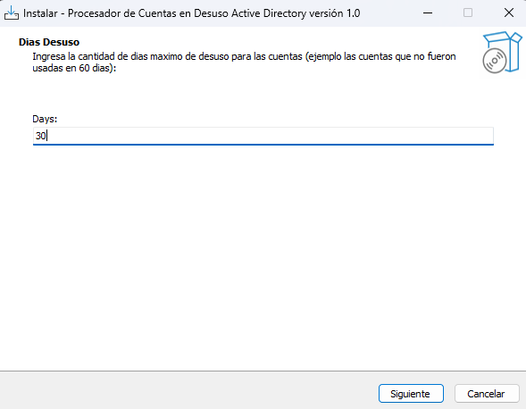
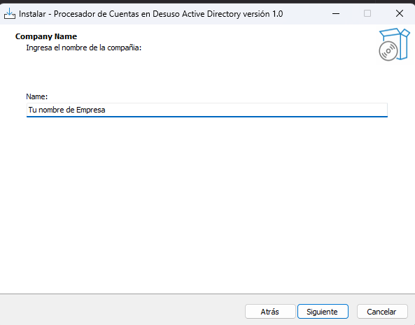
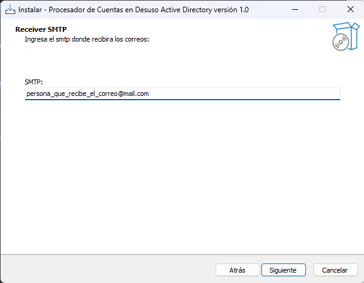
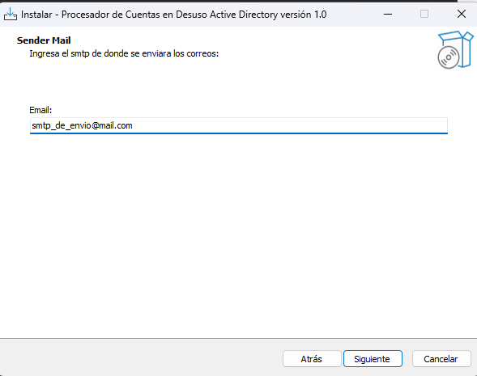
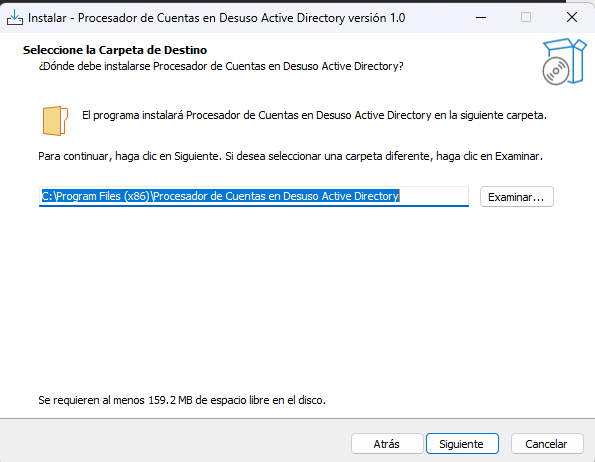
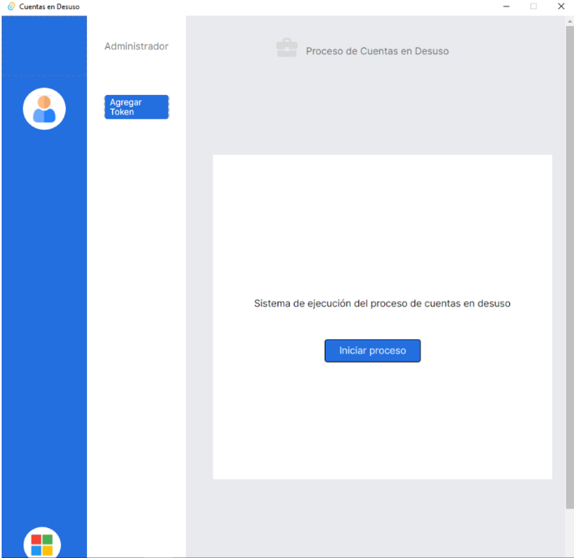
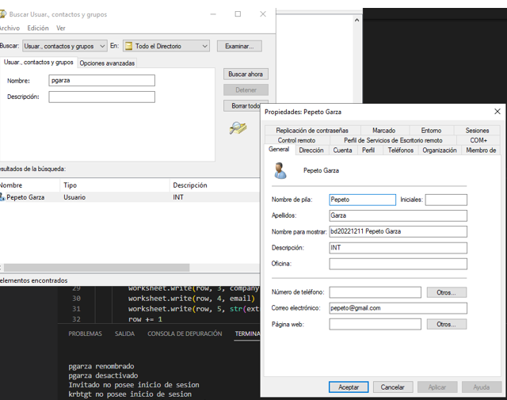

<!--

<!-- PROJECT SHIELDS -->
<!--
*** I'm using markdown "reference style" links for readability.
*** Reference links are enclosed in brackets [ ] instead of parentheses ( ).
*** See the bottom of this document for the declaration of the reference variables
*** for contributors-url, forks-url, etc. This is an optional, concise syntax you may use.
*** https://www.markdownguide.org/basic-syntax/#reference-style-links
-->
[![Contributors][contributors-shield]][contributors-url]
[![Forks][forks-shield]][forks-url]
[![Stargazers][stars-shield]][stars-url]
[![Issues][issues-shield]][issues-url]
[![MIT License][license-shield]][license-url]

<!-- PROJECT LOGO -->
 

  

<h3 align="center">Procesador de Cuentas en Desuso Active Directory</h3>

  

    Memoria de título presentada a la Facultad de Ingeniería de la Universidad Finis Terrae, para optar al título de ingeniero civil en informática y telecomunicaciones
     
    <a href="https://mrcoding-dev.github.io/Herramienta-Seguridad-ActiveDirectory-DOC/"><strong>Ver documentacion »</strong></a>
     
     
    <a href="https://github.com/mrcoding-dev/Herramienta-Seguridad-ActiveDirectory/issues">Reportar bug</a>
    ·
    <a href="https://github.com/mrcoding-dev/Herramienta-Seguridad-ActiveDirectory/issues">Solicitar una caracteristica</a>
  

<!-- ABOUT THE PROJECT -->
## Sobre el proyecto
La herramienta de gestión de cuentas en desuso en Active Directory es un software open source desarrollado como resultado de un trabajo de titulación centrado en mejorar la ciberseguridad en el entorno empresarial. El software fue diseñado específicamente para abordar las necesidades y problemas de la empresas en relación con la gestión manual de cuentas en desuso, lo que permitió mejorar la eficiencia y reducir las brechas de seguridad asociadas con la gestión de cuentas en desuso.

Al ser open source, la herramienta puede ser adaptada e implementada en diferentes entornos empresariales para mejorar la ciberseguridad y prevenir pérdidas económicas asociadas con los ciberataques. Además, la creación de este software sienta las bases para futuros desarrollos de productos digitales de ciberseguridad que puedan adaptarse a diferentes entornos empresariales y contribuir a la mejora continua de la ciberseguridad en el ámbito corporativo. En resumen, la herramienta de gestión de cuentas en desuso en Active Directory es una contribución valiosa al campo de la ciberseguridad y representa un paso importante hacia una mejor protección de los activos digitales en el entorno empresarial.

<!-- GETTING STARTED -->
## Primeros pasos

Si quieres compilar este sistema, necesitas tener Node.js, Tauri, Rust y Python instalados en tu computadora. Continúa siguiendo las instrucciones en el repositorio para configurar y ejecutar la herramienta de seguridad de Active Directory en tu entorno 

### Dependencias para compilarcion y desarrollo

* dependencias python

- altgraph==0.17.3
- anyio==3.6.2
- certifi==2022.12.7
- charset-normalizer==3.1.0
- click==8.1.3
- colorama==0.4.6
- fastapi==0.94.1
- future==0.18.3
- h11==0.14.0
- idna==3.4
- numpy==1.24.2
- pandas==1.5.3
- pefile==2023.2.7
- pyad==0.6.0
- pydantic==1.10.6
- pyinstaller==5.9.0
- pyinstaller-hooks-contrib==2023.1
- python-dateutil==2.8.2
- python-dotenv==1.0.0
- pytz==2022.7.1
- pywin32==305
- pywin32-ctypes==0.2.0
- requests==2.28.2
- six==1.16.0
- sniffio==1.3.0
- starlette==0.26.1
- typing_extensions==4.5.0
- urllib3==1.26.15
- uvicorn==0.21.1
- XlsxWriter==3.0.9

_Si quieres ver toda la documentacion de como compilar, ejecutar y desarrolar para aportar el sistema revisa la [Documentacion](https://mrcoding-dev.github.io/Herramienta-Seguridad-ActiveDirectory-DOC/)_

### Instalacion de sistema (Cliente)

1. Descarga el instalador desde [Ejecutable](https://github.com/mrcoding-dev/Herramienta-Seguridad-ActiveDirectory/releases/tag/estable)
2. Ejecuta el instalador en la vdi o servidor de windows server o una maquina con permisos de lectura conectada a la red
3. Sigue los pasos de instalacion

## Uso

<h1/>

(<a href="#readme-top">back to top</a>)

<!-- CONTRIBUTING -->

## Contribuciones

Si quieres contribuir a este proyecto, sigue los siguientes pasos:

1. Haz un fork del repositorio
2. Crea una rama para tu contribución (`git checkout -b mi-contribución`)
3. Haz un commit con tus cambios (`git commit -am 'Agregando mi contribución'`)
4. Haz un push a la rama (`git push origin mi-contribución`)
5. Haz un pull request desde GitHub

Por favor, asegúrate de seguir nuestro guía de estilo de código y de hacer test a tus cambios antes de hacer un pull request.

Gracias por tu contribución!

(<a href="#readme-top">back to top</a>)

<!-- LICENSE -->
## License

Este proyecto está bajo la licencia [MIT](https://opensource.org/licenses/MIT), lo que significa que es libre de usar y distribuir.

(<a href="#readme-top">back to top</a>)

<!-- CONTACT -->
## Contacto

Gabriel - [@mrcodingCL](https://twitter.com/mrcodingCL) - mrcoding.dev

(<a href="#readme-top">back to top</a>)

<!-- MARKDOWN LINKS & IMAGES -->
<!-- https://www.markdownguide.org/basic-syntax/#reference-style-links -->
[contributors-shield]: https://img.shields.io/github/contributors/othneildrew/Best-README-Template.svg?style=for-the-badge
[contributors-url]: https://github.com/othneildrew/Best-README-Template/graphs/contributors
[forks-shield]: https://img.shields.io/github/forks/othneildrew/Best-README-Template.svg?style=for-the-badge
[forks-url]: https://github.com/othneildrew/Best-README-Template/network/members
[stars-shield]: https://img.shields.io/github/stars/othneildrew/Best-README-Template.svg?style=for-the-badge
[stars-url]: https://github.com/othneildrew/Best-README-Template/stargazers
[issues-shield]: https://img.shields.io/github/issues/othneildrew/Best-README-Template.svg?style=for-the-badge
[issues-url]: https://github.com/mrcoding-dev/Herramienta-Seguridad-ActiveDirectory/issues
[license-shield]: https://img.shields.io/github/license/othneildrew/Best-README-Template.svg?style=for-the-badge
[license-url]: https://github.com/othneildrew/Best-README-Template/blob/master/LICENSE.txt
[linkedin-shield]: https://img.shields.io/badge/-LinkedIn-black.svg?style=for-the-badge&logo=linkedin&colorB=555
[linkedin-url]: https://linkedin.com/in/othneildrew
[product-screenshot]: images/screenshot.png
[Next.js]: https://img.shields.io/badge/next.js-000000?style=for-the-badge&logo=nextdotjs&logoColor=white
[Next-url]: https://nextjs.org/
